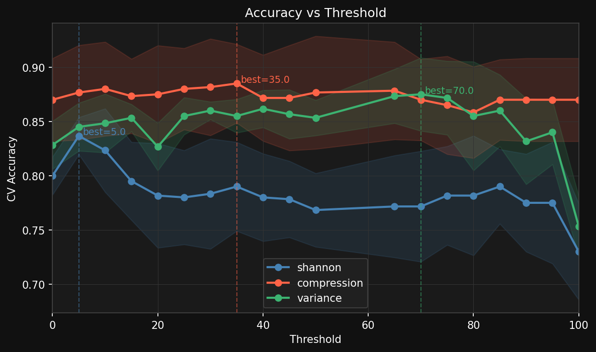
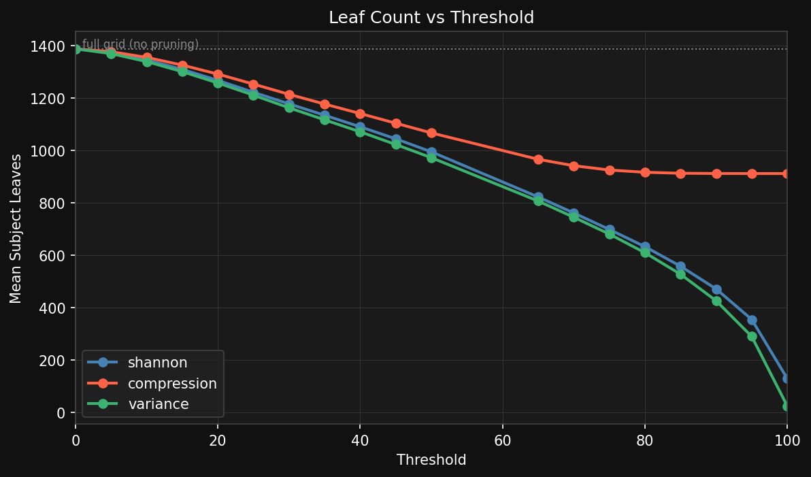
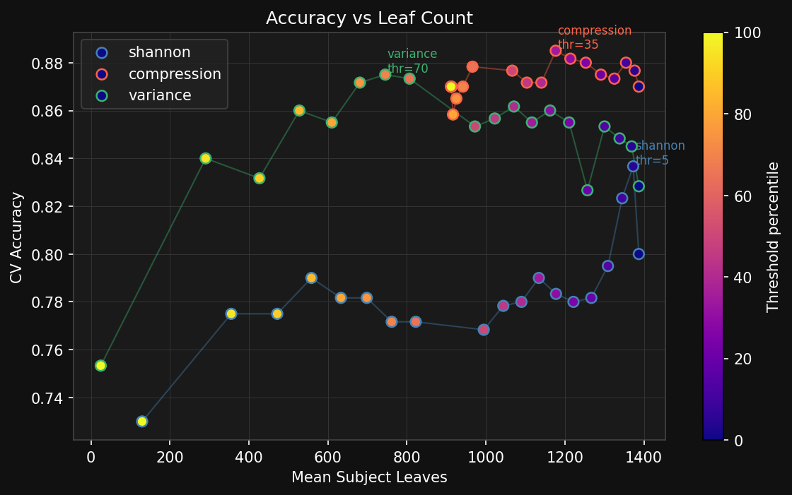

# entropy_viz

A Python tool that visualizes image complexity as an adaptive quadtree overlay using entropy scoring, with applications in AI-generated image detection and manipulation forensics.

---

## Overview

entropy_viz recursively subdivides an image into quadrants and scores each region for complexity. High-complexity regions — dense texture, fine detail, irregular structure — subdivide into smaller cells. Low-complexity regions — flat color, blurred backgrounds, repeated patterns — remain as large blocks. The result is an overlay where cell size and color both encode information density.

The core insight driving the project: compression ratio is a better proxy for true complexity than Shannon entropy. A blurred background has varied pixel values (high Shannon entropy) but compresses easily (low Kolmogorov complexity). zlib correctly identifies it as simple. Shannon does not. Variance offers a fast middle ground — cheaper than compression but more spatially grounded than Shannon.

---

## Install

```bash
pip install pillow numpy
```

Requires Python 3.7+.

---

## Usage

### Single image

```bash
# Shannon entropy, default leaf size (4px)
python main.py photo.jpg

# Compression entropy, default leaf size (16px)
python main.py photo.jpg --method compression

# Variance scorer, custom leaf size
python main.py photo.jpg --method variance --leaf-size 8

# Adaptive pruning — collapse least complex 25% of leaves after full build
python main.py photo.jpg --method compression --threshold 25

# Save to custom path, show legend and borders
python main.py photo.jpg -o result.png --legend --borders
```

### Batch processing

Run across one or more folders of images, producing overlay PNGs and a `features.csv`:

```bash
# Multiple folders in one run — builds a labeled dataset in a single pass
python3 batch.py --input real_photos/ ai_images/ --labels real ai --output results/

# Skip overlay rendering, extract features only (much faster)
python3 batch.py --input real_photos/ ai_images/ --labels real ai --output results/ --no-overlay

# Append a new class to an existing features.csv
python3 batch.py --input photoshopped/ --labels photoshopped --output results/ --append
```

### RealVsFake dataset (wish096)

```bash
python3 batch.py \
    --input "/home/penny/.cache/kagglehub/datasets/wish096/realvsfake-81k-by-wish/versions/3/RealVsFake/RealVsFake/Real" \
            "/home/penny/.cache/kagglehub/datasets/wish096/realvsfake-81k-by-wish/versions/3/RealVsFake/RealVsFake/Fake" \
    --labels real ai \
    --output results/ --no-overlay --workers 8 --method compression --threshold 11
```

### Scatter plot

Visualize how well complexity features separate image classes:

```bash
# Default: mean_complexity vs std_complexity
python3 scatter.py results/features_compression.csv

# Specify axes
python3 scatter.py results/features_compression.csv --x mean_boundary_delta --y std_complexity

# Generate all useful feature pair plots, skipping highly correlated pairs
python3 scatter.py results/features_compression.csv --auto --output results/scatter/

# Stricter correlation pruning
python3 scatter.py results/features_compression.csv --auto --corr-threshold 0.85
```

---

## How It Works

**Scoring methods**

Three complexity scorers are available, all returning a normalized float in `[0, 1]`:

- **Shannon entropy** — measures pixel value distribution across all channels as a single flattened histogram. Fast, works well at small leaf sizes.
- **Compression ratio** — compresses raw pixel bytes with zlib and measures how much they shrink. Slower but more principled — approximates Kolmogorov complexity from above. Reliable at `leaf_size >= 16`.
- **Variance** — computes `np.var` across pixel values. Fastest scorer. Raw values are adaptively normalized using the 99th percentile of the image's own distribution with sqrt stretching — no hardcoded constants.

All scorers accept an optional opacity mask and only score opaque pixels, so transparent regions don't corrupt the complexity measurement of boundary nodes.

**Quadtree construction**

The image is recursively split into four quadrants using a two-pass approach:

Pass 1 — build to full depth. Splitting stops when:
- The child would be at or below `leaf_size` pixels (resolution-independent — equivalent spatial granularity across any image size)
- Region is >= 95% transparent (background guard)

Pass 2 — percentile pruning (optional). If `--threshold` is set, leaf nodes below the Nth percentile of the image's own complexity distribution are collapsed back into their parent. This is fully content-adaptive — the cutoff is derived from the image itself, not a fixed value.

**Leaf size defaults**

| Method | Default leaf size | Rationale |
|--------|-------------------|-----------|
| `shannon` | 4px | Works accurately at fine grain |
| `variance` | 4px | Works accurately at fine grain |
| `compression` | 16px | zlib unreliable below ~768 bytes |

**Adaptive variance normalization**

When rendering an overlay with `--method variance`, the raw variance scores are rescaled using `sqrt(var / p99)` where `p99` is the 99th percentile of the image's own leaf variances. This ensures the full color range is used regardless of image content. Normalization is skipped during `--no-overlay` batch runs for speed.

**Background masking**

For RGBA images, each node is tagged with `background_ratio` (fraction of transparent pixels). Nodes above `BG_THRESHOLD` (0.95) are excluded from complexity statistics and shown as neutral grey in the overlay.

**Visualization**

Subject nodes are colored by complexity score: blue (low) → green → yellow → red (high). Background nodes appear as neutral grey. The output PNG preserves the original alpha channel so transparent regions remain transparent. Borders and legend are opt-in via `--borders` and `--legend`.

**Feature extraction**

Each quadtree is distilled into a feature vector and written to `features.csv`:

| Feature | Description |
|---------|-------------|
| `mean_complexity` | Average complexity across subject leaf nodes |
| `std_complexity` | Variance — low in AI images which tend toward uniform complexity |
| `complexity_range` | max − min — spread of the distribution |
| `mean_boundary_delta` | Average complexity jump between parent and child nodes |
| `leaf_count` | Total subject leaf count |
| `mean_merge_delta` | Average std(children) / parent across all splits — heterogeneity revealed per split |
| `max_merge_delta` | Peak merge delta — highlights manipulation boundaries |
| `std_merge_delta` | Variance of merge deltas — high in real photos, low in AI images |
| `merge_delta_bin_0–7` | Histogram of merge delta distribution using logarithmic bin edges — captures distribution shape beyond mean/max/std |

---

## Files

| File | Purpose |
|------|---------|
| `complexity.py` | Shannon, compression, and variance scorers with opacity mask support |
| `quadtree.py` | `QuadNode` dataclass and `QuadTree` builder with background masking |
| `visualizer.py` | Overlay rendering, RGBA preservation, and colorbar legend |
| `features.py` | Feature extraction and CSV export |
| `scatter.py` | Scatter plot visualization of extracted features |
| `main.py` | Single image CLI entry point |
| `batch.py` | Batch processing, feature extraction, and labeled dataset pipeline |
| `classify.py` | Train and evaluate classifiers on extracted features |
| `tune_threshold.py` | Hyperparameter tuning for the pruning threshold |
| `tune_plots.py` | Visualization of threshold tuning results |

---

## Options

**main.py**

| Flag | Default | Description |
|------|---------|-------------|
| `--method` | `shannon` | `shannon`, `compression`, or `variance` |
| `--leaf-size` | method default | Target leaf side length in pixels |
| `--threshold` | off | Percentile (0–100) — prune least complex leaves after full build |
| `--alpha` | `120` | Overlay opacity (0–255) |
| `--borders` | off | Show quadrant border lines |
| `--legend` | off | Show colorbar legend |

**batch.py** (includes all main.py options plus):

| Flag | Default | Description |
|------|---------|-------------|
| `--input` | required | One or more input folders of images |
| `--labels` | required | One label per folder, same order as `--input` |
| `--append` | off | Append to existing `features.csv` instead of overwriting |
| `--no-overlay` | off | Skip overlay rendering, extract features only |
| `--workers` | `1` | Number of parallel workers |

**scatter.py**

| Flag | Default | Description |
|------|---------|-------------|
| `--x` | `mean_complexity` | Feature for the x axis |
| `--y` | `std_complexity` | Feature for the y axis |
| `--output` | alongside CSV | Output folder for plot(s) |
| `--auto` | off | Generate scatter plots for all useful feature pairs |
| `--corr-threshold` | `0.9` | Skip pairs with Pearson \|r\| above this value (only with `--auto`) |

**classify.py**

| Flag | Default | Description |
|------|---------|-------------|
| `--output` | alongside CSV | Path to save results text file |
| `--test-size` | `0.2` | Fraction of data held out for testing |
| `--features` | all | Feature columns to use |
| `--fast` | off | Run only Logistic Regression and Random Forest |
| `--balance` | off | Undersample majority class to balance dataset |
| `--cv` | `5` | Number of cross-validation folds |

**tune_threshold.py**

| Flag | Default | Description |
|------|---------|-------------|
| `--input` | required | One or more folders of images (one per class) |
| `--labels` | required | One label per folder, same order as `--input` |
| `--thresholds` | `0 10 20 30 40 50 60` | Percentile values to sweep |
| `--method` | `shannon` | Scoring method |
| `--leaf_size` | `4` | Target leaf side length in pixels |
| `--max_images` | off | Cap images per class — useful for fast pilot runs |
| `--workers` | `4` | Parallel workers for image loading |
| `--output` | `tune_results.csv` | Base output path — written as `tune_results_{method}.csv` |
| `--append` | off | Merge new threshold values into existing CSV instead of overwriting |

---

## Proof of Concept — AI Detection

The compression quadtree produces meaningfully different signatures for real photographs and AI-generated images. Initial results on the RealVsFake dataset (81k real vs AI-generated images) show visible separation in feature space using only `mean_complexity` and `std_complexity`:


Real images cluster toward lower mean complexity and higher variance — natural photographs have regions of simple and complex content. AI-generated images cluster toward higher mean complexity and lower variance — generators produce uniformly high complexity with little internal differentiation.

**What the quadtree reveals on individual images:**

- **Real photograph** — smooth complexity gradient. Face scores moderate (green), hair shows genuine internal variation. No hard discontinuities.
- **AI-generated** — hair and skin score uniformly high (red/orange) with little internal variation. The generator hallucinates plausible texture everywhere.
- **Photoshopped** — recolored regions are flattened in complexity. A hard discontinuity appears at the manipulation boundary.

These signatures emerge from no training data and no learned model — purely from information-theoretic properties of the image content.

**Classifier results (RealVsFake, 161,972 images, Random Forest)**

All runs used `--balance` to equalize class counts. Thresholds are the per-method optima identified by `tune_threshold.py`.

| Method | Threshold | Test accuracy | CV score |
|--------|-----------|--------------|----------|
| Compression | 11 | **90.1%** | 88.0% ± 0.3% |
| Shannon | 13 | 89.0% | 86.9% ± 0.2% |
| Variance | 71 | 85.0% | 82.6% ± 0.1% |

Compression is the clear winner. The ~2% gap between test accuracy and CV score is consistent across all three methods, indicating mild but uniform overfitting — not a red flag.

**Linear models** (Logistic Regression, Linear SVM) score 70–75% on compression and shannon but collapse to ~59% on variance. Variance's signal is real but highly non-linear — the Random Forest finds it, linear separators cannot. Compression and shannon do not have this problem.

**`max_complexity`** scores exactly 0.0000 importance in the compression Random Forest — every image has at least one fully complex leaf, so the value is always 1.0 and carries no information. It is a safe feature to drop for compression runs.

**Merge delta features** (`mean_merge_delta`, `max_merge_delta`, `std_merge_delta`) are consistently useful across all three methods and all model types. They are the most method-agnostic signal in the feature set — measuring how much internal heterogeneity is revealed at each quadtree split. Real photographs show high variance at splits; AI images do not.

**`min_complexity`** is the dominant feature in variance (37.5% importance in Gradient Boosting) but ranks lower in compression and shannon. Variance scores can reach true zero on flat regions, making the minimum a strong discriminator. Compression and shannon scores compress toward a narrow range where the minimum is less distinctive.

**Merge delta histogram**

The merge delta distribution is summarised both as scalar statistics (`mean_merge_delta`, `max_merge_delta`, `std_merge_delta`) and as an 8-bin histogram (`merge_delta_bin_0` through `merge_delta_bin_7`). The histogram captures distribution shape — two images with identical means can have completely different profiles, which the scalar stats cannot distinguish.

Bin edges are logarithmic rather than linear, concentrating resolution where the mass actually sits:

| Bin | Range | Description |
|-----|-------|-------------|
| 0 | 0.000 – 0.010 | Very low delta — flat AI regions |
| 1 | 0.010 – 0.021 | |
| 2 | 0.021 – 0.045 | |
| 3 | 0.045 – 0.097 | Transition zone |
| 4 | 0.097 – 0.207 | |
| 5 | 0.207 – 0.440 | |
| 6 | 0.440 – 0.938 | |
| 7 | 0.938 – 2.000 | High delta tail — manipulation boundaries, real texture |

Each bin value is a fraction of total splits, so all bins sum to 1.0 and are comparable across images of different sizes.

**Histogram effectiveness by method**

The histogram was evaluated against the baseline (no histogram) on the RealVsFake dataset:

| Method | RF baseline | RF + linear bins | RF + log bins | Best Δ |
|--------|-------------|-----------------|---------------|--------|
| Compression | 90.13% | 89.97% | 90.05% | −0.08% |
| Variance | 85.03% | **85.47%** | — | +0.44% |

For compression, the merge delta distribution is too concentrated (90% of splits fall below 0.25) for the histogram to add signal beyond what `mean_merge_delta` and `std_merge_delta` already capture — the Random Forest is neutral to slightly negative. For variance, the distribution is wider and the histogram provides genuine additional signal, improving RF accuracy by +0.44% with linear bins. Log bins were tested on compression and showed no meaningful improvement over linear for that method.

The histogram is included in the default feature set. For compression-only runs it can be dropped via `--features` without accuracy cost.

**Threshold tuning**

The pruning threshold is a hyperparameter that controls how aggressively low-complexity leaves are collapsed after the full tree is built. Tuning is done without trial and error using `tune_threshold.py`, which builds each quadtree once and sweeps prune cutoffs in memory — making the full sweep as fast as a single batch run.



Key findings from threshold tuning on the RealVsFake dataset:

- **Compression** is nearly flat across the full threshold range (87–88%), with a shallow peak around threshold=35. The signal is robust — the features that matter aren't concentrated in the low-complexity leaves being pruned away, so pruning neither helps nor hurts much.
- **Shannon** peaks early at threshold=5 and declines steadily. Low-complexity leaves contribute useful signal for Shannon, so pruning them away hurts.
- **Variance** shows the clearest rise-then-fall shape, peaking around threshold=70. Variance is most affected by noise from near-zero regions; pruning those cleanly improves the signal before the tree becomes too sparse.

**Why the methods diverge — leaf count**

The leaf count plot explains why the three curves behave so differently under pruning:



Compression prunes far fewer leaves than Shannon or variance at the same threshold percentile. Its complexity values are tightly clustered — most leaves score similarly — so the bottom 35% of the distribution is only a shallow cut. Shannon and variance have wider, more spread-out distributions, so the same percentile threshold removes significantly more of the tree. This is why compression's accuracy is stable across the full range while the other two methods show a clear sensitivity to threshold choice.

**Accuracy vs leaf count**

Viewing accuracy as a function of tree size rather than threshold percentile reveals the true operating point of each method:



Compression operates in the upper-right of this space — high accuracy at high leaf count — and barely moves as pruning increases. Variance climbs steeply from the bottom-left as pruning removes noisy near-zero leaves, then plateaus. Shannon starts high but falls away once too many informative leaves are removed. The color encoding (threshold percentile) shows that compression's best points cluster at moderate thresholds (orange/red), while variance's best points are at higher thresholds (yellow/green).

**Leaf size**

`leaf_size` controls the spatial resolution of the quadtree — the minimum side length in pixels at which splitting stops. It is a separate hyperparameter from threshold and affects all three methods differently. Compression has a hard lower bound of `leaf_size=16` because zlib's header overhead dominates at smaller block sizes, making compression ratios unreliable. Shannon and variance work accurately at `leaf_size=4` — a 4px block contains enough pixels for a meaningful entropy or variance calculation, whereas a 1×1 pixel leaf has no relative complexity to measure. Increasing leaf size reduces tree depth and leaf count uniformly, which decreases feature resolution but speeds up both build time and classification. The defaults are chosen to be the smallest reliable value for each method.

**Recommended configuration:** `--method compression --threshold 11`, giving **90.1% test accuracy** on the RealVsFake dataset.

---

## Known Limitations

- **Shannon entropy** produces a noisy grid at high depth due to statistical artifacts in small blocks. Use `--method compression` or increase `--leaf-size` to mitigate.
- **Compression scoring** is unreliable at `leaf_size < 16` — zlib header overhead dominates at small block sizes.
- **Variance normalization** is per-image, so raw feature values are not directly comparable across images processed independently. The relative ordering within an image is preserved.
- **Boundary nodes** that straddle the subject/background edge are scored on their opaque pixels only, which can produce elevated complexity scores if the subject content in that cell is detailed.
- **RealVsFake** images are face-centric — results may not generalize to non-portrait subjects without further validation.
- **Fixed-grid trees** — without `--threshold`, all trees terminate at exactly `leaf_size`, producing a constant `leaf_count` and `mean_depth` across all images. These features carry no information unless adaptive pruning is enabled.
- **`max_complexity`** is always 1.0 for compression runs and contributes zero importance — safe to drop via `--features` when using `--method compression`.

---

## Future Plans

**Near term**
- ✅ Feature extraction: distill each quadtree into a feature vector exportable as CSV
- ✅ Scatter plot visualization of feature separation across labeled datasets
- ✅ Correlation-based pair pruning in scatter --auto to eliminate redundant plots
- ✅ Variance scorer: fast alternative to compression with adaptive normalization
- ✅ Resolution-independent splitting via leaf_size
- ✅ Two-pass percentile pruning for content-adaptive threshold
- ✅ Lightweight classifier: logistic regression, SVM, random forest, gradient boosting on extracted features

**Medium term**
- ✅ Threshold hyperparameter tuning without trial and error
- ✅ Full classifier evaluation on RealVsFake 161k dataset — compression RF achieves 90.1%
- ✅ Merge delta histogram — logarithmic bins capture distribution shape; +0.44% RF accuracy on variance
- Expand dataset: test against FFHQ (real) vs StyleGAN / Stable Diffusion outputs
- Drop `max_complexity` from compression feature set and re-evaluate

**Longer term**
- Video pipeline: extract frames, build a complexity tensor across time, measure temporal stability of face-region complexity
- Audio-visual correlation: score whether facial complexity changes correlate with audio energy — a signal that breaks in dubbed or voice-synthesized deepfakes
- Benchmark against neural network deepfake detectors on unseen generative architectures — the architecture-agnostic approach should generalize where trained detectors fail

---

## Related Work

**Synthbuster** (2024) is the closest non-neural approach in the literature. It applies a cross-difference filter to highlight periodic artifacts in synthetic images, then extracts spectral features in the frequency domain and classifies them using gradient boosting. It targets GAN-specific upsampling artifacts — a different signal and a different domain from complexity-based analysis. Unlike Synthbuster, this project makes no assumptions about the generative architecture.

General frequency-domain analysis has shown that GAN-generated images exhibit periodic spectral artifacts caused by upsampling operations. Compression-based complexity is architecture-agnostic by design and does not rely on these artifacts, which may not be present in diffusion-model outputs.

---

## Background

The theoretical grounding for this project is Kolmogorov complexity — the length of the shortest program that produces a given output. True Kolmogorov complexity is uncomputable (proven via reduction to the halting problem), but compression ratio provides a computable upper bound. The project explores how far this approximation can take a practical detector.

The spatial distribution of complexity — not just a single score — is where the signal lives. A deepfake has a specific quadtree signature: a low-variance complexity island (the generated face) surrounded by a high-delta boundary ring, embedded in naturally varying terrain. That pattern is rare in unmanipulated photographs and detectable without any knowledge of the generative model that produced it.