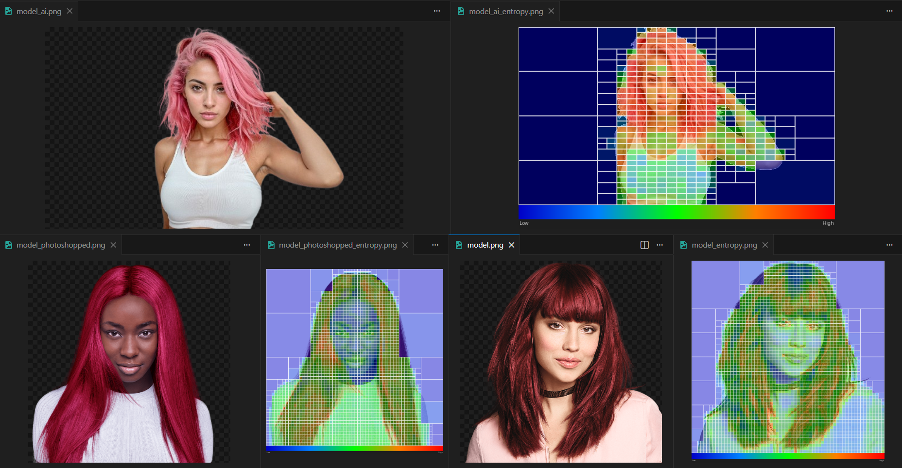

# Entropy_Quadtree

A Python tool that visualizes image complexity as an adaptive quadtree overlay using compression-based entropy scoring, with applications in AI-generated image detection and manipulation forensics.

---

## Overview

entropy_quadtree recursively subdivides an image into quadrants and scores each region for complexity. High-complexity regions — dense texture, fine detail, irregular structure — subdivide into smaller cells. Low-complexity regions — flat color, blurred backgrounds, repeated patterns — remain as large blocks. The result is an overlay where cell size and color both encode information density.

---

## Install

```bash
pip install pillow numpy
```

---

## Usage

```bash
# Compression entropy, adaptive depth
python main.py photo.jpg --method compression --max-depth 6

# Shannon entropy, fixed depth
python main.py photo.jpg --method shannon --max-depth 5

# Both stopping conditions active
python main.py photo.jpg --method compression --max-depth 6 --threshold 0.4

```

---

## How It Works

**Scoring methods**

Two complexity scorers are available, both returning a normalized float in `[0, 1]`:

- **Shannon entropy** — measures pixel value distribution. Fast but blind to spatial repetition. Two images A and A+A (A concatenated with itself) score identically, which is wrong.
- **Compression ratio** — compresses raw pixel bytes with zlib and measures how much they shrink. Correctly scores A+A as less complex than A. Slower but more principled — it approximates Kolmogorov complexity from above.

**Quadtree construction**

The image is recursively split into four quadrants. Splitting stops when any of the following are met:

- `max_depth` is reached (fixed mode)
- Region complexity falls below `threshold` (adaptive mode)
- Region becomes smaller than `min_size` pixels

Both stopping conditions can be active simultaneously.

**Visualization**

Each leaf node is drawn as a rectangle colored by its complexity score. The colormap runs blue (low) → green → yellow → red (high). Border lines between cells reveal the tree structure.

---

## Files

| File | Purpose |
|------|---------|
| `complexity.py` | Shannon entropy and compression ratio scorers |
| `quadtree.py` | `QuadNode` dataclass and `QuadTree` builder |
| `visualizer.py` | Overlay rendering and colorbar legend |
| `main.py` | CLI entry point |

---

## Options

| Flag | Default | Description |
|------|---------|-------------|
| `--method` | `shannon` | `shannon` or `compression` |
| `--max-depth` | `6` | Max split depth. `0` = adaptive only |
| `--threshold` | off | Stop splitting below this complexity score |
| `--min-size` | `8` | Minimum region side length (pixels) |
| `--alpha` | `120` | Overlay opacity (0–255) |
| `--no-borders` | off | Hide quadrant border lines |
| `--no-legend` | off | Omit colorbar legend |

---

## Proof of Concept — AI Detection

The compression quadtree produces meaningfully different signatures for real photographs, AI-generated images, and photoshopped images. The comparison below uses three portraits of models with dyed hair — one real photograph, one AI-generated, and one photograph with the hair color changed in Photoshop.



**What the quadtree reveals:**

- **Real photograph (bottom-right)** — smooth complexity gradient across the subject. Face scores moderate (green), hair shows genuine internal variation with highlights and strand direction producing locally different scores. No hard discontinuities.

- **AI-generated (top)** — hair region scores uniformly high (red/orange) with little internal variation. The generator hallucinates plausible texture everywhere, producing complexity that is high but suspiciously homogeneous. Large background blocks reflect the trivially simple transparent region.

- **Photoshopped hair (bottom-left)** — the recolored hair is flattened in complexity relative to the face. A hard complexity discontinuity appears at the manipulation boundary — the compressor sees the recolored region as more repetitive than surrounding original content. The face scores anomalously low relative to a natural portrait (note that this may be an artifact of the darker skin tone, further testing is needed).

These signatures emerge from no training data and no learned model — purely from information-theoretic properties of the image content.

---

## Known Limitations

- **Shannon entropy** produces a noisy grid at high depth (blocking artifact) because small blocks score erratically. Use `--method compression` or raise `--min-size` to mitigate.
- **Compression thresholds** are not on the same scale as Shannon thresholds. A `--threshold` of `0.1` that works for Shannon will prune almost everything with compression. Start around `0.4` for compression.
- **Transparent background regions** are currently composited to white and scored as low complexity. Background masking using the original alpha channel is needed.

---

## Future Plans

**Near term**
- Background masking: use the original alpha channel to exclude transparent regions from scoring, stats, and the overlay entirely
- Feature extraction: distill each quadtree into a small feature vector (mean complexity, internal variance, boundary delta sharpness) exportable as CSV
- Comparison mode: diff two images' complexity profiles side by side with a delta visualization

**Medium term**
- Labeled dataset pipeline: run the scorer across folders of known-real and known-AI images, output per-image feature CSVs, visualize population separation
- Lightweight classifier: logistic regression on extracted features — no neural networks, architecture-agnostic by design
- Merge-step delta scoring: measure the information gained at each split boundary, not just leaf complexity — this is where manipulation boundaries show up most clearly

**Longer term**
- Video pipeline: extract frames, build a complexity tensor across time, measure temporal stability of face-region complexity frame-to-frame
- Audio-visual correlation: score whether facial complexity changes correlate with audio energy — a signal that breaks in dubbed or voice-synthesized deepfakes
- Benchmark against neural network deepfake detectors on unseen generative architectures — the architecture-agnostic approach should generalize where trained detectors fail

---

## Background

The theoretical grounding for this project is Kolmogorov complexity — the length of the shortest program that produces a given output. True Kolmogorov complexity is uncomputable (proven via reduction to the halting problem), but compression ratio provides a computable upper bound. The project explores how far this approximation can take a practical detector.

The spatial distribution of complexity — not just a single score — is where the signal lives. Theoretically, a deepfake has a specific quadtree signature: a low-variance complexity island (the generated face) surrounded by a high-delta boundary ring, embedded in naturally varying terrain. That pattern is rare in unmanipulated photographs and detectable without any knowledge of the generative model that produced it.